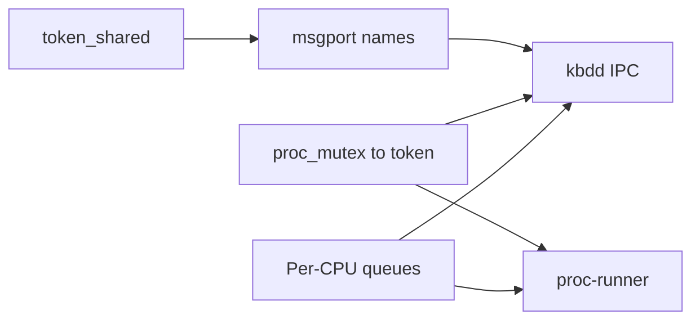

# MyOS — дорожная карта (DragonFly-inspired)

План развития ядра в сторону LWKT + tokens + message passing.
Каждая фаза — отдельный коммит/PR, проверка: `make run`, `cpus`, `ping`, `exec threads.elf`.

---

## Фаза 1 — Per-CPU run queue ✅

**Цель:** планировщик как в DragonFly — локальная очередь на CPU, без единого глобального списка.

| Было | Стало |
|------|-------|
| `run_queues[]` глобально | `struct cpu.run_queues[MAX_PRIORITY]` |
| Любой CPU берёт любой поток | CPU сначала local, затем **work steal** |
| `sched_lock` на всё | per-CPU queues + steal; позже per-CPU `queue_lock` (фаза 1c) |

**Файлы:** `include/cpu.h`, `kernel/sched/lwkt.c`, `kernel/arch/x86_64/smp.c`, `docs/SMP.md`

**Проверка:**
```text
cpus          # switches растут на обоих CPU; Steals/Pulls/IPI-rx
exec threads.elf
smpbalance    # IPI targeted >> broadcast
```

---

## Фаза 1b — Targeted IPI + fairness metrics ✅

**Цель:** точечный wake и телеметрия.

| Было | Стало |
|------|-------|
| Broadcast IPI после enqueue | `lwkt_sched_ipi_cpu(run_cpu)` / local preempt |
| Мало телеметрии | Steals/Pulls/IPI в `cpus`/`smpbalance`/`threads` |

**Проверка:** `help` → `ping` → `exec threads.elf` → `uthreads` → `smpbalance` → `cpus`

---

## Фаза 1c — Per-CPU `queue_lock` ✅

**Цель:** убрать глобальный `sched_lock` с hot path.

| Было | Стало |
|------|-------|
| один `sched_lock` | `cpu->queue_lock` + `thread_pool_lock` |
| steal под одним lock | `queue_lock_two` по `cpu->id`; pin yielder; claim `RUNNING` |
| idle в run queue | idle не enqueue; foreign steal пропускает idle/pinned |

**Проверка:** `qemu_kse_test.exp`; ≥20× `threads.elf` на `-smp 8`; `smpbalance` (Steals/Pulls, IPI).

---

## Фаза 2 — `token_shared` (readers/writers) ✅

**Цель:** read-mostly структуры без spinlock на чтении (vnode stats, module table, …).

```c
struct token_shared {
    spinlock_t guard;
    int readers;
    struct lwkt_thread *writer;      /* exclusive write waiters */
    struct lwkt_thread *read_waiters;
    struct lwkt_thread *write_waiters;
};

void token_shared_init(struct token_shared *t);
void token_shared_read_lock(struct token_shared *t);
void token_shared_read_unlock(struct token_shared *t);
void token_shared_write_lock(struct token_shared *t);
void token_shared_write_unlock(struct token_shared *t);
```

**Правила (как DragonFly):** writer exclusive; readers параллельно; writer ждёт всех readers.

**Тест:** unit в kernel — 2 LWKT readers + 1 writer, счётчик без гонок.

**Файлы:** `include/token.h`, `kernel/sched/token.c`, `docs/TOKEN.md`

---

## Фаза 3 — `proc_mutex` → token ✅

**Цель:** одна дисциплина сна в userland-синхронизации.

| Было | Стало |
|------|-------|
| `struct proc_mutex { spinlock, locked, waiters }` | `struct proc_mutex { struct token lock; }` |
| `wait_next` на LWKT | только token waiters |

**API userland не меняется** (`MYOS_MUTEX_*` syscalls).

**Файлы:** `include/proc_mutex.h`, `kernel/proc/proc_mutex.c`

**Проверка:** `exec threads.elf` → `counter=10`

---

## Фаза 4 — Расширение msgport ✅

**Цель:** порты по имени и типизированные сообщения (не только `mbox_slot`).

### 4a. Именованные порты

```c
int  msgport_register(const char *name, struct lwkt_thread *owner);
int  msgport_lookup(const char *name);          /* lwkt id */
int  msg_send_name(const char *name, uint32_t type, const void *data, uint32_t size);
```

Реестр: фиксированная таблица (~16 имён): `msgd`, `kbdd`, …

### 4b. Типы сообщений

```c
#define MSG_TYPE_DATA     0
#define MSG_TYPE_PING     1
#define MSG_TYPE_PONG     2
#define MSG_TYPE_KBD_CHAR 0x10
#define MSG_TYPE_KBD_WAIT 0x11
#define MSG_TYPE_WAKEUP   0xFE
```

### 4c. Syscall (опционально)

`MYOS_SYS_MSG_SEND_NAME` — shell `msg msgd hello` без знания LWKT id.

**Проверка:** `ping`, `msg hello`

**Файлы:** `include/msgport.h`, `kernel/sched/msgport.c`, `kernel/syscall/syscall.c`

---

## Фаза 5 — Подсистемы через IPC (`kbdd`) ✅

**Цель:** клавиатура не вызывается напрямую из `sys_read`; IRQ → сообщение → поток `kbdd`.

```
IRQ keyboard ──► ring buffer (spinlock, коротко)
                      │
                      ▼ msg TYPE_KBD_CHAR
                 ┌─────────┐
                 │  kbdd   │  token на состояние reader
                 └────┬────┘
                      │ MSG_KBD_WAIT / reply
                      ▼
                 sys_read (shell LWKT)
```

**Шаги:**
1. `kbdd_start()` — LWKT поток при boot (как `msgd`)
2. IRQ: `ring_push` + `msg_send_name("kbdd", MSG_KBD_CHAR, &scancode, 1)`
3. `kbdd` хранит `waiting_thread`, будит через `lwkt_unblock`
4. `sys_read` → `msg_send_name("kbdd", MSG_KBD_WAIT, …)` + block на reply port
5. Убрать `keyboard_set_reader` / прямой `lwkt_unblock` из `keyboard.c`

**Проверка:** быстрый ввод, `help`, `cpus`, `exec threads.elf`

**Файлы:** `kernel/drivers/keyboard.c`, `kernel/sched/kbdd.c` (new), `kernel/main.c`

---

## Фаза 7 — proc-runner (1 LWKT на user-proc) ✅

**Цель:** in-proc планирование uthread; один LWKT-runner на процесс (DragonFly user scheduling, упрощённо).

| Было | Стало |
|------|-------|
| 1 uthread = 1 LWKT (`u1`, `u2.1`) | 1 runner `pN` на proc |
| `lwkt_yield` из syscall | `uthread_yield` + `return_to_runner` |
| `THREAD_CREATE` → `lwkt_id` | → `uthread_id` (TID) |
| `kbdd` через msgport из syscall | poll IRQ ring из syscall |
| AP idle: global yield storm | local `hlt` + `THREAD_READY` only |

**Полное описание, инварианты syscall/SMP idle, чеклист:** [PROC_RUNNER.md](PROC_RUNNER.md)

**Проверка:**

```text
make run SMP=8
# htop: ~0–10% в простое на MyOS>
help
exec threads.elf
threads    # p1, p2 — runners
uthreads
cpus
```

**Файлы:** `include/proc.h`, `include/lwkt.h`, `include/uthread.h`, `kernel/sched/uthread.c`,
`kernel/proc/exec.c`, `kernel/proc/proc_mutex.c`, `kernel/sched/kbdd.c`, `kernel/sched/lwkt.c`,
`kernel/syscall/syscall.c`, `user/myos.h`

---

## Фаза 7b — proc-runner hardening (syscall resched) ✅

**Цель:** единый безопасный путь для блокирующих syscall внутри runner (`MYOS_ERR_AGAIN` + `wait_edge` / in-proc yield), без `lwkt_block()`-loop в syscall.

**Сделано:**

- `lwkt_syscall_resched(retry_ret)` — wait_edge + `user_syscall_ret` (с early-return при `runner_reswitch`);
- `proc_mutex_lock` (KSE + runner) / `uthread_join` / `SYS_READ` / msg recv-ping — retry через `MYOS_ERR_AGAIN`;
- `schedmode 0` на shell задаёт режим **дочерних** `exec` (shell остаётся KSE);
- `exec` будит `p->runner`; heal race `p->runner` до первого schedule;
- `SYS_READ`: runner → AGAIN+yield; UP KSE → wait_edge+AGAIN (`myos_read_char` yield); SMP KSE → park в wait_edge (без yield-storm);
- `ipc_bump` шлёт IPI если dest не `READY` (починка `ping` после per-CPU locks);
- async `token_shared` MP selftest отключён на boot (READY LWKT → starvation на SMP=1);
- тест: `tools/qemu_runner_7b_test.exp`.

**Проверка:**

```bash
expect tools/qemu_runner_7b_test.exp build/myos.iso 1 2 4 8
expect tools/qemu_kse_test.exp
# SMP=16: известный crash на ping ещё на main (не регрессия 7b)
```

**Критерий done:** `ping` / `msg` / `exec threads.elf` (×2) / `threads` / `uthreads` / `cpus` на SMP=1..8; KSE-регрессия зелёная.

---

## Зависимости



- Фазы **2** и **3** независимы от 1 (можно параллельно).
- **5** требует **4** (именованный порт `kbdd`) и желательно **1** (SMP-safe scheduling).
- **7** (proc-runner) требует **1** (SMP) и **3** (proc_mutex/token); см. [PROC_RUNNER.md](PROC_RUNNER.md).

---

## Что не копируем из DragonFly

- Целые файлы ядра (UVM, buf, vnode, …) — несовместимы с MyOS.
- Берём **паттерны** и переписываем под наш `lwkt` / `token` / `msgport` (~100–300 строк на примитив).

См. также [TOKEN.md](TOKEN.md), [SMP.md](SMP.md), [PROC_RUNNER.md](PROC_RUNNER.md), [DEVELOPMENT.md](DEVELOPMENT.md).
