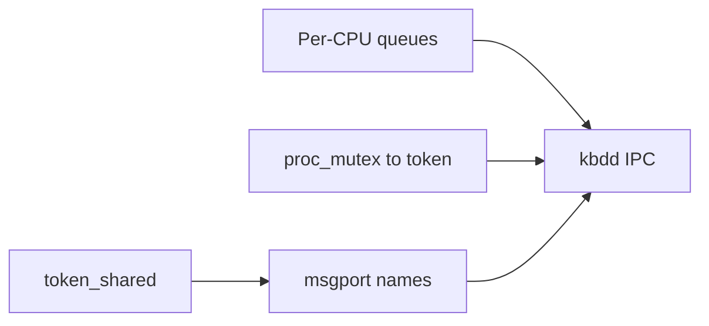

# MyOS — дорожная карта (DragonFly-inspired)

План развития ядра в сторону LWKT + tokens + message passing.
Каждая фаза — отдельный коммит/PR, проверка: `make run`, `cpus`, `ping`, `exec threads.elf`.

---

## Фаза 1 — Per-CPU run queue ✅

**Цель:** планировщик как в DragonFly — локальная очередь на CPU, без единого глобального списка.

| Было | Стало |
|------|-------|
| `run_queues[]` глобально | `struct cpu.run_queues[MAX_PRIORITY]` |
| Любой CPU берёт любой поток | CPU сначала local, затем **work steal** |
| `sched_lock` на всё | `sched_lock` пока общий (фаза 1b — per-CPU lock опционально) |

**Файлы:** `include/cpu.h`, `kernel/sched/lwkt.c`, `kernel/arch/x86_64/smp.c`, `docs/SMP.md`

**Проверка:**
```text
cpus          # switches растут на обоих CPU
exec threads.elf
cpus
```

---

## Фаза 2 — `token_shared` (readers/writers) ✅

**Цель:** read-mostly структуры без spinlock на чтении (vnode stats, module table, …).

```c
struct token_shared {
    spinlock_t guard;
    int readers;
    struct lwkt_thread *writer;      /* exclusive write waiters */
    struct lwkt_thread *read_waiters;
    struct lwkt_thread *write_waiters;
};

void token_shared_init(struct token_shared *t);
void token_shared_read_lock(struct token_shared *t);
void token_shared_read_unlock(struct token_shared *t);
void token_shared_write_lock(struct token_shared *t);
void token_shared_write_unlock(struct token_shared *t);
```

**Правила (как DragonFly):** writer exclusive; readers параллельно; writer ждёт всех readers.

**Тест:** unit в kernel — 2 LWKT readers + 1 writer, счётчик без гонок.

**Файлы:** `include/token.h`, `kernel/sched/token.c`, `docs/TOKEN.md`

---

## Фаза 3 — `proc_mutex` → token ✅

**Цель:** одна дисциплина сна в userland-синхронизации.

| Было | Стало |
|------|-------|
| `struct proc_mutex { spinlock, locked, waiters }` | `struct proc_mutex { struct token lock; }` |
| `wait_next` на LWKT | только token waiters |

**API userland не меняется** (`MYOS_MUTEX_*` syscalls).

**Файлы:** `include/proc_mutex.h`, `kernel/proc/proc_mutex.c`

**Проверка:** `exec threads.elf` → `counter=10`

---

## Фаза 4 — Расширение msgport ✅

**Цель:** порты по имени и типизированные сообщения (не только `mbox_slot`).

### 4a. Именованные порты

```c
int  msgport_register(const char *name, struct lwkt_thread *owner);
int  msgport_lookup(const char *name);          /* lwkt id */
int  msg_send_name(const char *name, uint32_t type, const void *data, uint32_t size);
```

Реестр: фиксированная таблица (~16 имён): `msgd`, `kbdd`, …

### 4b. Типы сообщений

```c
#define MSG_TYPE_DATA     0
#define MSG_TYPE_PING     1
#define MSG_TYPE_PONG     2
#define MSG_TYPE_KBD_CHAR 0x10
#define MSG_TYPE_KBD_WAIT 0x11
#define MSG_TYPE_WAKEUP   0xFE
```

### 4c. Syscall (опционально)

`MYOS_SYS_MSG_SEND_NAME` — shell `msg msgd hello` без знания LWKT id.

**Проверка:** `ping`, `msg hello`

**Файлы:** `include/msgport.h`, `kernel/sched/msgport.c`, `kernel/syscall/syscall.c`

---

## Фаза 5 — Подсистемы через IPC (`kbdd`) ✅

**Цель:** клавиатура не вызывается напрямую из `sys_read`; IRQ → сообщение → поток `kbdd`.

```
IRQ keyboard ──► ring buffer (spinlock, коротко)
                      │
                      ▼ msg TYPE_KBD_CHAR
                 ┌─────────┐
                 │  kbdd   │  token на состояние reader
                 └────┬────┘
                      │ MSG_KBD_WAIT / reply
                      ▼
                 sys_read (shell LWKT)
```

**Шаги:**
1. `kbdd_start()` — LWKT поток при boot (как `msgd`)
2. IRQ: `ring_push` + `msg_send_name("kbdd", MSG_KBD_CHAR, &scancode, 1)`
3. `kbdd` хранит `waiting_thread`, будит через `lwkt_unblock`
4. `sys_read` → `msg_send_name("kbdd", MSG_KBD_WAIT, …)` + block на reply port
5. Убрать `keyboard_set_reader` / прямой `lwkt_unblock` из `keyboard.c`

**Проверка:** быстрый ввод, `help`, `cpus`, `exec threads.elf`

**Файлы:** `kernel/drivers/keyboard.c`, `kernel/sched/kbdd.c` (new), `kernel/main.c`

---

## Зависимости



- Фазы **2** и **3** независимы от 1 (можно параллельно).
- **5** требует **4** (именованный порт `kbdd`) и желательно **1** (SMP-safe scheduling).

---

## Что не копируем из DragonFly

- Целые файлы ядра (UVM, buf, vnode, …) — несовместимы с MyOS.
- Берём **паттерны** и переписываем под наш `lwkt` / `token` / `msgport` (~100–300 строк на примитив).

См. также [TOKEN.md](TOKEN.md), [SMP.md](SMP.md), [DEVELOPMENT.md](DEVELOPMENT.md).
